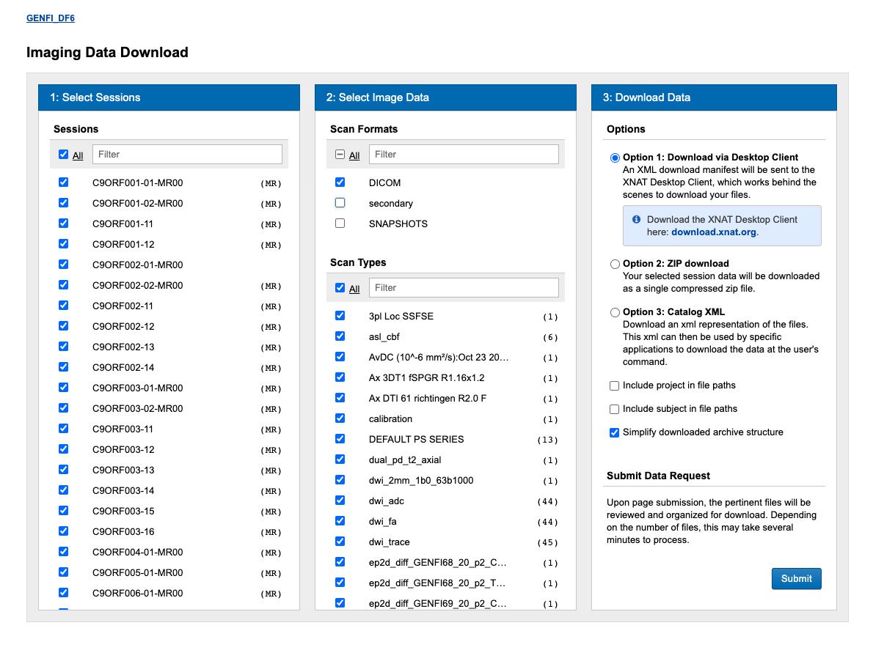

<!-- markdownlint-disable MD046 -->
# `genfi-to-bids` – Conversion of the GENFI to BIDS

!!! quote "Description reproduced from the [GENFI webpage](https://www.genfi.org)"
    The Genetic Frontotemporal dementia Initiative (GENFI) is a group of research centres across Europe and Canada with expertise in familial FTD, and is co-ordinated by Professor Jonathan Rohrer at University College London. GENFI is the largest genetic FTD consortium to date and currently consists of sites across the UK, Netherlands, Belgium, France, Spain, Portugal, Italy, Germany, Sweden, Denmark, Finland and Canada. The aim of the study is to understand more about genetic FTD, particularly in those who have mutations in the progranulin (GRN), microtubule-associated protein tau (MAPT) and chromosome 9 open reading frame 72 (C9orf72) genes. GENFI investigates both people who have developed symptoms and also people who have a risk of developing symptoms in the future because they carry an abnormal genetic mutation. By studying these individuals who are destined to develop the disease later in life we can understand the development from the very earliest changes. The key objectives of GENFI are therefore to develop markers which help identify the disease at its earliest stage as well as markers that allow the progression of the disease to be tracked. We are now collaborating closely with other similar studies around the world through the FTD Prevention Initiative. Through this worldwide initiative we are working with pharmaceutical companies to help design clinical trials for genetic FTD.

## Dependencies

If you installed the core of Clinica, this converter needs the `dcm2niix` package.

## Supported modalities

Please note that this converter currently processes the following modalities : 
- T1W
- T2W
- DWI
- Fieldmaps
- rsfMRI

## Downloading GENFI

To download GENFI in a way that you can convert it, you need to make sure of two things: 
- Only select the "simplify downloaded archive structure" in download data options.
- Select only "DICOM" in "Select Image Data" section "Scans Format".



## Using the converter

The converter can be run with the following command line:

```Text
clinica convert genfi-to-bids [OPTIONS] DATASET_DIRECTORY CLINICAL_DATA_DIRECTORY BIDS_DIRECTORY 
```

where:

- `DATASET_DIRECTORY` is the path to the original GENFI imaging directory, whose content should look like:

    ```text
    DATASET_DIRECTORY
    ├── C9ORF001-01-MR00
    │   ├── 1
    │   ├── 11
    │   ├── 12
    │   └── 13
    ├── C9ORF001-11
    │   ├── 1
    │   ├── 2
    │   ├── 4
    │   ├── 5
    │   ├── 6
    │   ├── 7
    │   ├── 8
    │   └── 9
    └── GRN001-01-MR00
        ├── 1
        ├── 10
        ├── 8
        └── 9
    ```

- `CLINICAL_DATA_DIRECTORY` is the path to the directory containing the clinical excel files.

- `BIDS_DIRECTORY` is the path to the output directory where the BIDS-converted version of GENFI will be stored.

!!! note
    In order to improve the readability, the BIDS subject ID is the genetic group concatenated with the original GENFI ID and is defined as follows:

    ```Text
    sub-GRN/C9ORF/MAPT+ original numerical ID of the subject
    ```

    !!! example
        If the original subject ID is `0001`, the final BIDS ID will be `sub-GRN0001`.

## Citing this converter in your paper

!!! cite "Example of paragraph:"
    The GENFI data have been curated and converted to the Brain Imaging Data Structure (BIDS) format [[Gorgolewski et al., 2016](https://doi.org/10.1038/sdata.2016.44)] using Clinica [[Routier et al.](https://hal.inria.fr/hal-02308126/); [Samper-González et al., 2018](https://doi.org/10.1016/j.neuroimage.2018.08.042)].

!!! tip
    Easily access the papers cited on this page on [Zotero](https://www.zotero.org/groups/2240070/clinica_aramislab/items/collectionKey/NASGJPVL).
