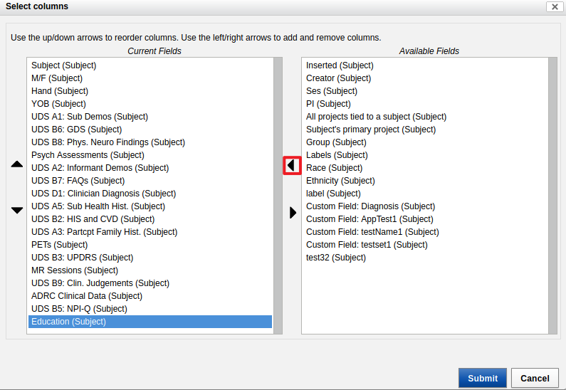

<!-- markdownlint-disable MD046 -->
# `oasis3-to-bids` – Conversion of the Open Access Series of Imaging Studies (OASIS-3) to BIDS

!!! quote "Description reproduced from the [OASIS' webpage](http://oasis-brains.org/)"
    The Open Access Series of Imaging Studies (OASIS) is a project aimed at making MRI data sets of the brain freely available to the scientific community.
    By compiling and freely distributing MRI data sets, we hope to facilitate future discoveries in basic and clinical neuroscience.
    OASIS is made available by the Washington University Alzheimer’s Disease Research Center, Dr. Randy Buckner at the Howard Hughes Medical Institute (HHMI) at Harvard University, the Neuroinformatics Research Group (NRG) at Washington University School of Medicine, and the Biomedical Informatics Research Network (BIRN).

    The "Longitudinal Neuroimaging, Clinical, and Cognitive Dataset for Normal Aging and Alzheimer’s Disease" set
    is a retrospective compilation of data for >1000 participants that were collected across several ongoing projects 
    through the WUSTL Knight ADRC over the course of 30 years. Participants include 609 cognitively normal adults 
    and 489 individuals at various stages of cognitive decline ranging in age from 42-95yrs. All participants 
    were assigned a new random identifier and all dates were removed and normalized to reflect days from entry
     into study. The dataset contains over 2000 MR sessions which include T1w, T2w, FLAIR, ASL, SWI, time of 
     flight, resting-state BOLD, and DTI sequences. Many of the MR sessions are accompanied by volumetric 
     segmentation files produced through Freesurfer processing. PET imaging from 3 different tracers, 
     PIB, AV45, and FDG, totaling over 1500 raw imaging scans and the accompanying post-processed files from
      the Pet Unified Pipeline (PUP) are also available in OASIS-3.

  For more information about the images and the dataset you can read the [OASIS-3: Imaging Methods and Data Dictionary](https://www.oasis-brains.org/files/OASIS-3_Imaging_Data_Dictionary_v1.5.pdf).

## Dependencies

If you installed the core of Clinica, this converter needs no further dependencies.

## Downloading OASIS-3

### Clinical data

The OASIS-3 to BIDS converter requires the user to have downloaded the OASIS-3 (also called *Longitudinal Neuroimaging, Clinical, and Cognitive Dataset for Normal Aging and Alzheimer’s Disease*) imaging and clinical data. To do so, visit the [OASIS website](http://www.oasis-brains.org/), click on `DATASETS` then `OASIS-3`. For the first access, you have to scroll down to click on `Apply To Access OASIS Data` in the bottom of the next "Data Use Agreement" section and follow the procedure. Then, you can download the data via XNAT (if you click on `Browse Data`).

The data needs to be formatted before downloading by following the step-by-step procedure below.

1. From the menu on the right of the "Subjects" data table, click on the "Edit Columns" option.


2. Select "Education (Subject)" from the "Available Fields".


3. Click on the arrow to send it to the left, to "Current Fields".



4. From the menu on the right of the data table, load the "MR sessions" table.


5. From the menu on the right of the loaded "MR Sessions" data table, click on the "Edit Columns" option, select "Age (MR Sessions)" from the "Available Fields" and click on the arrow to send it to the left, to "Current Fields".


6. Select "Age (MR Sessions)" from the "Current Fields" and click on the arrow to send it to the right, to "Available Fields".


7. Check that the Age column in the "MR Sessions" table contains decimal values and not integers.


8. From the menu, load the table "ADRC Clinical Data" as well as "PETs" and "PUPs".

9. In the options, export a "Spreadsheet" of the five tables "Subjects, "MR Sessions", "ADRC Clinical Data", "PETs" and "PUPs".

10. Put the spreadsheets in a folder.

11. 

!!! note
    You do not have to modify the original folder name before using the converter.

!!! warning
    We do not currently support the conversion of OASIS-2.
    
### Imaging data

To download the images of the OASIS-3 dataset:

1. From the page on which you were to download the clinical date, click on "Download Images" button. You will have a download interface with different options, such as shown below.


2. In the "Select Sessions" part, select the sessions you want to work with.
 
3. For the "Select Image Data" part:

    a. For the "Scan Format" select *both* BIDS and NIFTI. Otherwise, you will be missing data.
    
    b. For the "Scan Types", select only T1w and pet, since it is the only format converted right now.
    
    c. For the "Additional Resources", select BIDS.
    
    d. For the "Assessments", do not select anything.
    
4. Click submit to download. We advise that you use the XNAT Desktop Client which will be more efficient than download through your web browser.

## Supported modalities

Please note that this converter only processes T1-weighted MRI images and the clinical data. Support for additional
modalities may be implemented later.

For participants with multiple T1-weighted images available, the average of the motion-corrected co-registered
individual images resampled to 1-mm isotropic resolution is given priority.

## Using the converter

The converter can be run with the following command line:

```Text
clinica convert oasis3-to-bids [OPTIONS] DATASET_DIRECTORY CLINICAL_DATA_DIRECTORY BIDS_DIRECTORY 
```

where:

- `DATASET_DIRECTORY` is the path to the original OASIS-3 imaging directory, which content should look like:

    ```text
    DATASET_DIRECTORY
    ├── OAS30001_MR_d0757
    │   ├── anat1
    │   │   ├── sub-OAS30001_ses-d0757_acq-TSE_T2w.json
    │   │   └── sub-OAS30001_ses-d0757_acq-TSE_T2w.nii.gz
    │   ├── anat2
    │   │   ├── ...
    │   ├── ...
    │   ├── dwi1
    │   │   ├── sub-OAS30001_ses-d0757_dwi.bval
    │   │   ├── sub-OAS30001_ses-d0757_dwi.bvec
    │   │   ├── sub-OAS30001_ses-d0757_dwi.json
    │   │   └── sub-OAS30001_ses-d0757_dwi.nii.gz
    │   ├── func1
    │   │   ├── sub-OAS30001_ses-d0757_task-rest_run-01_bold.json
    │   │   └── sub-OAS30001_ses-d0757_task-rest_run-01_bold.nii.gz
    │   ├── func2
    │   │   ├── ...
    │   ├── swi1
    │   │   ├── sub-OAS30001_ses-d0757_minIP.json
    │   │   └── sub-OAS30001_ses-d0757_minIP.nii.gz
    │   └── swi2
    │       ├── ...
    └── ...
    └── OAS30002_AV45_d2340
        ├── BIDS
        │   └── dataset_description.json
        ├── OAS30002_AV45_PUPTIMECOURSE_d2340
        │   └── SNAPSHOTS
        │       ├── OAS30002_AV45_d2340_m0_t.jpg
        │       ├── ...
        └── pet1
            ├── BIDS
            │   ├── sub-OAS30002_ses-d2340_acq-AV45_pet.json
            │   └── sub-OAS30002_ses-d2340_acq-AV45_pet.tsv
            └── NIFTI
                └── sub-OAS30002_ses-d2340_acq-AV45_pet.nii.gz
    └── ...
    ```

- `CLINICAL_DATA_DIRECTORY` is the path to the directory containing the clinical CSV files.

- `BIDS_DIRECTORY` is the path to the output directory where the BIDS-converted version of OASIS-3 will be stored.

!!! note
    In order to improve the readability, the BIDS subject ID is different from the original OASIS-3 ID and is defined as follows:

    ```Text
    sub-OASIS3+ original numerical ID of the subject
    ```

    !!! example
        If the original subject ID is `OAS30001`, since the numerical ID is `0001`, the final BIDS ID will be `sub-OASIS30001`.

## Citing this converter in your paper

!!! cite "Example of paragraph:"
    The OASIS-3 data have been curated and converted to the Brain Imaging Data Structure (BIDS) format [[Gorgolewski et al., 2016](https://doi.org/10.1038/sdata.2016.44)] using Clinica [[Routier et al.](https://hal.inria.fr/hal-02308126/); [Samper-González et al., 2018](https://doi.org/10.1016/j.neuroimage.2018.08.042)].

!!! tip
    Easily access the papers cited on this page on [Zotero](https://www.zotero.org/groups/2240070/clinica_aramislab/items/collectionKey/NASGJPVL).
