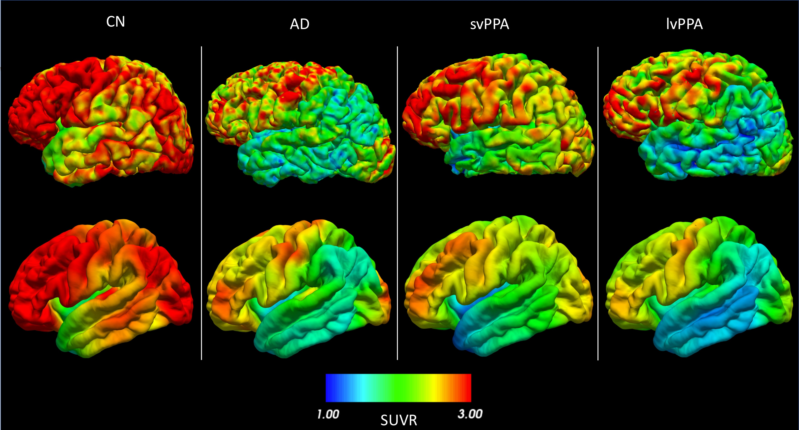
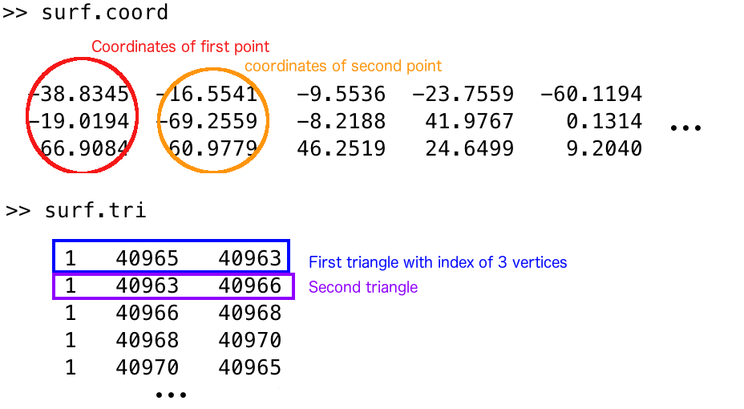
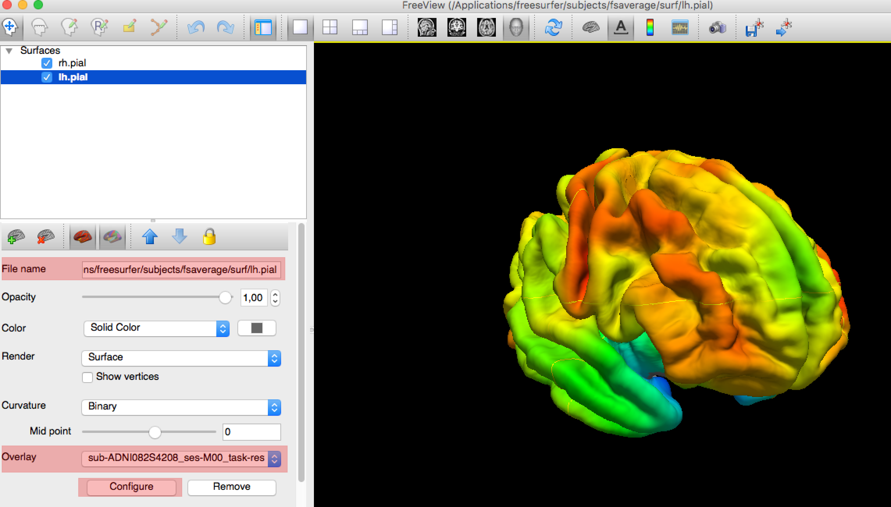
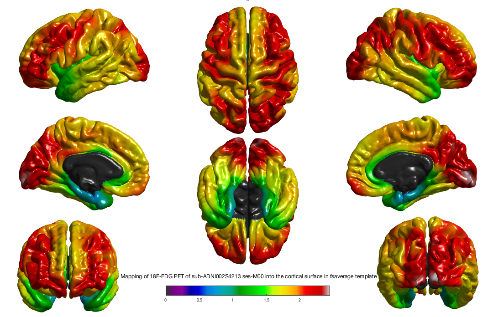

<!-- markdownlint-disable MD033 MD046 -->
# `pet-surface` - Surface-based processing of PET images

This pipeline performs several processing steps for the analysis of PET data on the cortical surface [[Marcoux et al., 2018](https://doi.org/10.3389/fninf.2018.00094)]:

- co-registration of PET and T1-weighted MR images;
- intensity normalization;
- partial volume correction;
- robust projection of the PET signal onto the subject’s cortical surface;
- spatial normalization to a template;
- atlas statistics.

This pipeline relies mainly on tools from **[FreeSurfer](https://surfer.nmr.mgh.harvard.edu/)** and **[PETPVC](https://github.com/UCL/PETPVC)** [[Thomas et al., 2016](https://doi.org/10.1088/0031-9155/61/22/7975)].

!!! note "Clinica & BIDS specifications for PET modality"
    Since Clinica `v0.6`, PET data following the official specifications in BIDS version `1.6.0` are now compatible with Clinica.
    See [BIDS](../BIDS.md) page for more information.

## Prerequisite

You need to have performed the [`t1-freesurfer`](./T1_FreeSurfer.md) pipeline on your T1-weighted MR images.

## Dependencies

If you only installed the core of Clinica, this pipeline needs the installation of [FreeSurfer 6.0](../Software/Third-party.md#freesurfer), [FSL 6.0](../Software/Third-party.md#fsl), and [PETPVC 1.2.4](../Software/Third-party.md#petpvc) (which depends on [ITK 4](../Software/Third-party.md#itk)) on your computer.

In addition, you also need to either install [SPM12](../Software/Third-party.md#spm12) and [Matlab](../Software/Third-party.md#matlab), or [spm standalone](../Software/Third-party.md#spm12-standalone).

## Running the pipeline

The pipeline can be run with the following command line:

```shell
clinica run pet-surface [OPTIONS] BIDS_DIRECTORY CAPS_DIRECTORY ACQ_LABEL
                        {pons|cerebellumPons|pons2|cerebellumPons2} PVC_PSF_TSV 
```

where:

- `BIDS_DIRECTORY` is the input folder containing the dataset in a [BIDS](../BIDS.md) hierarchy.
- `CAPS_DIRECTORY` acts both as an input folder (where the results of the `t1-freesurfer` pipeline are stored) and as the output folder containing the results in a [CAPS](../CAPS/Introduction.md) hierarchy.
- `ACQ_LABEL` is the label given to the PET acquisition, specifying the tracer used (`trc-<acq_label>`).
- The reference region is used to perform intensity normalization (i.e. dividing each voxel of the image by the average uptake in this region) resulting in a [standardized uptake value ratio (SUVR)](../glossary.md#suvr) map. It can be `cerebellumPons` or `cerebellumPons2` (used for amyloid tracers) or `pons` or `pons2` (used for FDG).
- `PVC_PSF_TSV` is the TSV file containing the `psf_x`, `psf_y` and `psf_z` of the PSF for each PET image. It is expected to be generated by the user. More explanation is given in [PET Introduction](./PET_Introduction.md) page.


!!! info
    Since the release of Clinica v0.3.8, the handling of PSF information has changed.
    In previous versions of Clinica, each BIDS-PET image had to contain a JSON file with the `EffectiveResolutionInPlane` and `EffectiveResolutionAxial` fields corresponding to the PSF in mm.
    `EffectiveResolutionInPlane` is replaced by both `psf_x` and `psf_y`, `EffectiveResolutionAxial` is replaced by `psf_z` and the `acq_label` column has been added.
    Additionally, the SUVR reference region is now a compulsory argument: it will be easier for you to modify Clinica if you want to add a custom reference region ([PET Introduction](../PET_Introduction) page).
    Choose `cerebellumPons` for amyloid tracers or `pons` for FDG to have the previous behavior.

Pipeline options:

- `-rec/--reconstruction_method`: Select only images based on a [specific reconstruction method](./PET_Introduction.md#reconstruction-methods).

??? info "Optional parameters common to all pipelines"
    --8<-- "snippets/pipelines_options.md:all"

Please note that PETPVC is extremely demanding in terms of resources and may cause the pipeline to crash if many subjects happen to be partial volume corrected at the same time (Error : `Failed to allocate memory for image`).
To mitigate this issue, you can do the following:

    1) Use a working directory when you launch Clinica.

    2) If the pipeline crashed, just launch again the command (while giving the same working directory).
    The whole processing will continue where it left (you can reduce the number of threads to run in parallel the second time).

!!! tip
    Do not hesitate to type `clinica run pet-surface --help` to see the full list of parameters.

--8<-- "snippets/known_issues.md:gtmseg"

## Outputs

Results are stored in the following folder of the
[CAPS hierarchy](../../CAPS/Specifications/#pet-surface-surface-based-processing-of-pet-images):
`subjects/<participant_id>/<session_id>/pet/surface`

The main output files are (where `*` stands for `<participant_id>_<session_id>`):

- `*_trc-<label>_pet_space-<label>_suvr-<label>_pvc-iy_hemi-<label>_fwhm-<value>_projection.mgh`:
PET data that can be mapped onto meshes.
If the `space` is `fsaverage`, it can be mapped either onto the white or pial surface of FsAverage.
If the `space` is `native`, it can be mapped onto the white or pial surface of the subject’s surface (i.e. `{l|r}h.white`, `{l|r}h.pial` files from the `t1-freesurfer` pipeline).
- `*_hemi-{left|right}_midcorticalsurface`:
surface at equal distance between the white matter/gray matter interface and the pial surface (one per hemisphere).
- `atlas_statistics/*_trc-<label>_pet_space-<label>_pvc-iy_suvr-<label>_statistics.tsv`:
TSV files summarizing the regional statistics on the labelled atlases (Desikan and Destrieux).

!!! note
    The full list of output files from the `pet-surface` pipeline can be found in [The ClinicA Processed Structure (CAPS) specifications](../CAPS/Specifications.md/#pet-surface---surface-based-processing-of-pet-images).

<center></center>
*<center><small>FDG PET SUVR projected onto the cortical surface (left hemisphere) for (from left to right) a cognitively normal subject (CN), a patient with Alzheimer’s disease (AD), a patient with semantic variant primary progressive aphasia (svPPA) and a patient with logopenic variant primary progressive aphasia (lvPPA).
The first row is the projection in the subject’s space.
The second row is the same signal for each subject, but warped to FsAverage after smoothing with a 20 mm Gaussian kernel.</small></center>*

## Going further

- You can use projected PET data to perform group comparison or correlation analysis with the [`statistics-surface` pipeline](../Stats_Surface).
- You can use projected PET data to perform classification based on [machine learning](../MachineLearning_Classification), as showcased in the [AD-ML framework](https://github.com/aramis-lab/AD-ML).

## Describing this pipeline in your paper

!!! cite "Example of paragraph:"
    These results have been obtained using the `pet-surface` pipeline of Clinica
    [[Routier et al., 2021](https://doi.org/10.3389/fninf.2021.689675);
    [Marcoux et al., 2018](https://doi.org/10.3389/fninf.2018.00094)].
    The subject’s PET image was registered to the T1-weighted MRI using spmregister
    ([FreeSurfer](https://surfer.nmr.mgh.harvard.edu/)) and intensity normalized using
    the [pons | pons and cerebellum] from the Pick atlas in MNI space as reference region
    (registration to MNI space was performed using
    [SPM12](https://www.fil.ion.ucl.ac.uk/spm/software/spm12/)).
    Partial volume correction was then performed using the iterative Yang algorithm implemented in
    [PETPVC](https://github.com/UCL/PETPVC)
    [[Thomas et al., 2016](https://doi.org/10.1088/0031-9155/61/22/7975)]
    with regions obtained from gtmseg ([FreeSurfer](https://surfer.nmr.mgh.harvard.edu/)).
    Based on the subject’s white surface and cortical thickness,
    seven surfaces for each hemisphere were computed,
    ranging from 35% to 65% of the gray matter thickness.
    The partial volume corrected data were projected onto these meshes and
    the seven values were averaged, giving more weight to the vertices near the center of the cortex.
    Finally, the projected PET signal in the subject’s native space was
    spatially normalized to the standard space of FsAverage
    ([FreeSurfer](https://surfer.nmr.mgh.harvard.edu/)).

!!! tip
    Easily access the papers cited on this page on
    [Zotero](https://www.zotero.org/groups/2240070/clinica_aramislab/items/collectionKey/RGVVHC5W).

## Appendix I: Diagram of the pipeline execution

<center></center>
*<center><small>The subject's T1-weighted MRI is coregistered with the PET image and the PET image is intensity normalized using the average uptake in a reference region.
In parallel, cortical surfaces and a parcellation are generated from the subject's T1-weighted MRI.
The PET image, after partial volume correction performed using the parcellation, is robustly projected onto the cortical surface.
Finally, regional mean uptake values are extracted from the projected PET data, and the projected PET signal in the subject's native space is spatially normalized to the standard space of FsAverage.</small></center>*

## Appendix II: How to manipulate outputs

Outputs of pipeline are composed of two different types of file: surface files and MGH data that are to be overlaid onto a surface.

### Surface file

Surface files can be read using various software packages.
You can open them using `freeview` (FreeSurfer viewer), with `freeview -f /path/to/your/surface/file`.

You can also open them in MATLAB, using SurfStat: `mysurface = SurfStatReadSurf('/path/to/your/surface/file')`.
This will give you a structure with fields `coord` (for coordinates), a list of coordinates for each point of the mesh, and also the field `tri` (for triangle), a list of triplet for each triangle, each number representing the Nth vertex of the `coord` list.
Below is an example to make things clearer (read with Matlab).

<center></center>

### Data files

Data files wear the `.mgh` extension.
They are composed of a single vector.
These files contain a vector, where the value at the Nth position must be mapped into the Nth vertex of the `coord` list to be correctly represented.
You can access them either in Matlab with the command:

```matlab
mydata = SurfStatReadData('/path/to/your/file.mgh');
```

(you will get a single row vector),

or in Python with the `nibabel` library:

```python
import nibabel
mydata = nibabel.load('/path/to/your/mgh/file')
```

`mydata` will then be a `MGHImage`, more information [here](http://nipy.org/nibabel/reference/nibabel.freesurfer.html#mghimage).
Keep in mind that if you want to manipulate the data vector within this object, you will need to transform it a bit.
Indeed, if you do the following:

```python
raw_data = mydata.get_fdata(dtype="float32")
print(raw_data.shape)
```

The shape of your "raw" vector will probably look like this: `(163842, 1, 1)`.
Use the `squeeze` function from `numpy` to get a `(163842,)` shape (documentation [here](https://docs.scipy.org/doc/numpy-1.13.0/reference/generated/numpy.squeeze.html)).
The reverse operation (`(163842,)` to a `(163842, 1, 1)` shape) can be achieved with the `atleast_3d` function from `numpy` (documentation [here](https://docs.scipy.org/doc/numpy-1.13.0/reference/generated/numpy.atleast_3d.html)).
This may come handy when you need to create a `MGHImage` from scratch.

### Visualization of the results

After the execution of the pipeline, you can check the outputs of a subject by running this command (subject moved into FsAverage):

```bash
freeview -f $SUBJECTS_DIR/fsaverage/surf/lh.pial:overlay=path/to/your/projected/pet/in/fsaverage/left/hemi \
 -f $SUBJECTS_DIR/fsaverage/surf/rh.pial:overlay=path/to/your/projected/pet/in/fsaverage/right/hemi
```

<center></center>

But you can also visualize your subject cortical projection directly into his native space:

```bash
freeview -f path/to/midcortical/surface/left:overlay=path/to/your/projected/pet/in/nativespace/left/hemi \
 -f path/to/midcortical/surface/right:overlay=path/to/your/projected/pet/in/nativespace/right/hemi
```

You will need to adjust the colormap using the `Configure` button in the left panel, just below the `Overlay` section.

You can also visualize your surface using the SurfStat tool.
Once the SurfStat installation folder is added to your MATLAB path,
you can display your surfaces with the following commands:

```matlab
mydata = SurfStatReadData({'/path/to/left/data', '/path/to/right/data'});
mysurfaces = SurfStatReadSurf({'/path/to/left/surface', '/path/to/right/surface'});
figure, SurfStatViewData(mydata, mysurfaces, 'Title of figure');
```

You will obtain the following figure:
<center></center>
