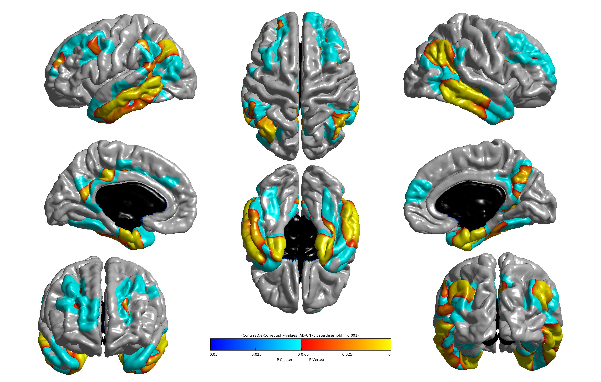

<!-- markdownlint-disable MD033-->
# `statistics-surface` - Surface-based mass-univariate analysis with SurfStat

This command performs statistical analysis (e.g. group comparison, correlation) on surface-based features using the general linear model (GLM).
To that aim, the pipeline relies on the Matlab toolbox [SurfStat](http://www.math.mcgill.ca/keith/surfstat/) designed for statistical analyses of univariate and multivariate surface and volumetric data using the GLM [[Worsley et al., 2009](http://dx.doi.org/10.1016/S1053-8119(09)70882-1)].

Surface-based measurements are analyzed on the FsAverage surface template (from FreeSurfer).

Currently, this pipeline can handle cortical thickness measurements from T1 images [`t1-freesurfer` pipeline](../T1_FreeSurfer) or map of activity from PET data using [`pet-surface` pipeline](../PET_Surface).

!!! note
    We are aware that the [SurfStat](http://www.math.mcgill.ca/keith/surfstat/) toolbox is not maintained anymore.
    The reasons why we rely on it are: 1) its great flexibility; 2) our profound admiration for the late Keith Worsley.

## Prerequisites

You need to process your data with the [`t1-freesurfer` pipeline](../T1_FreeSurfer) for measurements of cortical thickness measurements from T1 images or [`pet-surface` pipeline](../PET_Surface) for measurements of activity map from PET.

Do not hesitate to have a look at the paragraph **[Specifying what surface data to use](#advanced-specifying-what-surface-data-to-use)** if you want to use your own surface feature.

## Dependencies
<!--If you installed the docker image of Clinica, nothing is required.-->

If you only installed the core of Clinica, this pipeline needs the installation of **Matlab** and **FreeSurfer 6.0** on your computer.
You can find how to install these software packages on the [third-party](../../Third-party) page.
Note that the Matlab `Statistics and Machine Learning Toolbox` is required.

!!! bug "Compatibility issue with Matlab R2019 / R2020"
    It has been reported that newer versions of Matlab (see details on [GitHub](https://github.com/aramis-lab/clinica/issues/90)) were not compatible with this pipeline.
    For the moment, we advise you to use at most the R2018b version.
    Matlab versions between 2015 and 2018 are known to work.

## Running the pipeline

The pipeline can be run with the following command line:

```shell
clinica run statistics-surface [OPTIONS] CAPS_DIRECTORY GROUP_LABEL {t1-freesurfer|pet-surface|custom-pipeline}
                               {group_comparison|correlation} SUBJECT_VISITS_WITH_COVARIATES_TSV CONTRAST
```

where:

- `CAPS_DIRECTORY` is the folder containing the results of the [`t1-freesurfer`](../T1_FreeSurfer) or [`pet-surface`](../PET_Surface) pipeline and the output of the present command, both in a [CAPS hierarchy](../../CAPS/Introduction).
- `GROUP_LABEL` is a string defining the group label for the current analysis, which helps you keep track of different analyses.
- The third positional argument defines the type of surface-based feature: it can be `t1-freesurfer` for cortical thickness, `pet-surface` for projected PET data or `custom-pipeline` for you own data in CAPS directory (see below for details).
- The fourth positional argument is a string defining the type of analysis of your model, choose one between `group_comparison` and `correlation`.
- `SUBJECT_VISITS_WITH_COVARIATES_TSV` is a TSV file containing a list of subjects with their sessions and all the covariates and factors in your model (the content of the file is explained in the [Example](../Stats_Surface/#comparison-analysis) subsection).
- `CONTRAST` is a string defining the contrast matrix or the variable of interest for the GLM, e.g. `group` or `age`.

Pipeline options:

- `-c`, or `--covariates`: Covariates must be provided one at the time: `-c covariate_1 -c covariate_2`, or equivalentely `--covariates covariate_1  --covariates covariate_2`.
Each covariate must match the name of the TSV file.
By default, no covariate is considered.
- `--full_width_at_half_maximum`: FWHM for the surface smoothing.
Default value is `20`.

Pipeline options if you use inputs from the `pet-surface` pipeline:

- `--acq_label`: Name of the label given to the PET acquisition, specifying the tracer used (`trc-<acq_label>`).
- `--suvr_reference_region`: Reference region used to perform intensity normalization (i.e. dividing each voxel of the image by the average uptake in this region) resulting in a standardized uptake value ratio (SUVR) map.
It can be `cerebellumPons` (used for amyloid tracers) or `pons` (used for FDG).

!!! tip
    Check the [Example](../Stats_Surface/#comparison-analysis) subsection for further clarification.

## Outputs

### Group comparison analysis

Results are stored in the following folder of the [CAPS hierarchy](../../CAPS/Specifications/#group-comparison): `groups/<group_id>/statistics/surfstat_group_comparison/`.

The main outputs for the group comparison are:

- `<group_id>_<group_1>-lt-<group_2>_measure-<label>_fwhm-<label>_correctedPValue.jpg`: contains both the cluster level and the vertex level corrected p-value maps, based on the random field theory.
- `<group_id>_<group_1>-lt-<group_2>_measure-<label>_fwhm-<label>_FDR.jpg`: contains corrected p-value maps, based on the false discovery rate (FDR).
- `<group_id>_participants.tsv` is a copy of the `subject_visits_with_covariates_tsv` parameter file.
- `<group_id>_glm.json` is a JSON file containing all the model information of the analysis (i.e. what you wrote on the command line).

The `<group_1>-lt-<group_2>` means that the tested hypothesis is: "the measurement of `<group_1>` is lower than (`lt`) the measurement of `<group_2>`".
The pipeline includes both contrasts so `*<group_2>-lt-<group_1>*` files are also saved.

The FWHM value corresponds to the size in mm of the kernel used to smooth the surface and can be 5, 10, 15, 20.

Analysis with cortical thickness (respectively PET data) will be saved under the `_measure-ct` keyword (respectively the `_measure-<acq_label>` keyword).

!!! tip
    See the Example subsection for further clarification.

### Correlations analysis

Results are stored in the following folder of the
[CAPS hierarchy](../../CAPS/Specifications/#correlation-analysis):
`groups/<group_id>/statistics/surfstat_correlation/`.

The main outputs for the correlation are:

- `<group_id>_correlation-<label>_contrast-<label>_measure-<label>_fwhm-<label>_correctedPValue.jpg`: contains p-value maps corrected at both the cluster and vertex levels, based on the random field theory.
- `<group_id>_correlation-<label>_contrast-<label>_measure-<label>_fwhm-<label>_FDR.jpg`: contains corrected p-value maps, based on the false discovery rate (FDR).
- `<group_id>_correlation-<label>_contrast-<label>_measure-<label>_fwhm-<label>_T-statistics.jpg`: contains the maps of T statistics.
- `<group_id>_correlation-<label>_contrast-<label>_measure-<label>_fwhm-<label>_Uncorrected p-value.jpg`: contains the maps of uncorrected p-values.
- `<group_id>_participants.tsv` is a copy of the `subject_visits_with_covariates_tsv` parameter file.
- `<group_id>_glm.json` is a JSON file summarizing the parameters of the analysis (i.e. what you wrote on the command line).

The `correlation-<label>` describes the factor of the model, which can be for example `age`.
The `contrast-<label>` is the sign of your factor which can be `negative` or `positive`.

Analysis with cortical thickness (respectively PET data) will be saved under the `_measure-ct` keyword (respectively the `_measure-<acq_label>` keyword).

!!! note
    The full list of output files can be found in the [ClinicA Processed Structure (CAPS) specifications](../../CAPS/Specifications/#statistics-surface-surface-based-mass-univariate-analysis-with-surfstat).

<!--### GLM-->
<!--@TODO-->

## Example

### Comparison analysis

Let's assume that you want to perform a group comparison of cortical thickness between patients with Alzheimer’s disease (`group_1` will be called `AD`) and healthy subjects (`group_2` will be called `HC`).
`ADvsHC` will define the `group_label`.

The TSV file containing the participants and covariates will look like this:

```Text
participant_id    session_id    sex       group    age
sub-CLNC0001      ses-M00       Female    CN       71.1
sub-CLNC0002      ses-M00       Male      CN       81.3
sub-CLNC0003      ses-M00       Male      CN       75.4
sub-CLNC0004      ses-M00       Female    CN       73.9
sub-CLNC0005      ses-M00       Female    AD       64.1
sub-CLNC0006      ses-M00       Male      AD       80.1
sub-CLNC0007      ses-M00       Male      AD       78.3
sub-CLNC0008      ses-M00       Female    AD       73.2
```

Note that to make the display clearer, the rows contain successive tabs, which should not happen in an actual TSV file.

We call this file `ADvsHC_participants.tsv`.

For this group comparison, we will use `age` and `sex` as covariates.
As a result, the command line will be:

```Text
clinica run statistics-surface caps_directory ADvsHC t1-freesurfer group_comparison ADvsHC_participants.tsv group -c age -c sex
```

The parameters of the command line are stored in the `group-ADvsHC_glm.json` file:

```javascript
{
"DesignMatrix": "1 + age + sex + group"
"StringFormatTSV": "%s %f %f"
"Contrast": "group"
"ClusterThreshold": 0.001
}
```

The results of the group comparison between AD and HC are given by the `group-ADvsHC_AD-lt-HC_measure-ct_fwhm-20_correctedPValue.jpg` file and is illustrated as follows:

*<center>Visualization of corrected p-value map.</center>*

The blue area corresponds to the vertex-based corrected p-value and the yellow area represents the cluster-based corrected p-value.

### Correlation analysis

Let's now assume that you are interested in knowing whether cortical thickness is correlated with age using the same population as above, namely `ADvsHC_participants.tsv`.
The contrast will become `age` and we will choose `correlation` instead of `group_comparison`.

The command line is simply:

```Text
clinica run statistics-surface caps_directory ADvsHC t1-freesurfer correlation ADvsHC_participants.tsv age -c group -c sex
```

## Describing this pipeline in your paper

!!! cite "Example of paragraph (group comparison):"
    These results have been obtained using the `statistics-surface` command of Clinica [[Routier et al., 2021](https://doi.org/10.3389/fninf.2021.689675)].
    More precisely, a point-wise, vertex-to-vertex model based on the Matlab SurfStat toolbox (<http://www.math.mcgill.ca/keith/surfstat/>) was used to conduct a group comparison of whole brain cortical thickness.
    The data were smoothed using a Gaussian kernel with a full width at half maximum (FWHM) set to `<FWHM>` mm.
    The general linear model was used to control for the effect of `<covariate_1>`, ... and `<covariate_N>`.
    Statistics were corrected for multiple comparisons using the random field theory for non-isotropic images [[Worsley et al., 1999](http://dx.doi.org/10.1002/(SICI)1097-0193(1999)8:2/3<98::AID-HBM5>3.0.CO;2-F)].
    A statistical threshold of P < `<ClusterThreshold>` was first applied (height threshold).
    An extent threshold of P < 0.05 corrected for multiple comparisons was then applied at the cluster level.

!!! tip
    Easily access the papers cited on this page on [Zotero](https://www.zotero.org/groups/2240070/clinica_aramislab/items/collectionKey/U2APQD82).

## Support

- You can use the [Clinica Google Group](https://groups.google.com/forum/#!forum/clinica-user) to ask for help!
- Report an issue on [GitHub](https://github.com/aramis-lab/clinica/issues).

## (Advanced) Specifying what surface data to use

If you run the help command line `clinica run statistics-surface -h`, you will find two optional flags:

- `--feature_type FEATURE_TYPE` allows you to decide what feature type to take for your analysis.
If it is `cortical_thickness` (default value), the thickness file for each hemisphere and each subject and session of the tsv file will be used.
Keep in mind that those thickness files are generated using the `t1-freesurfer` pipeline, so be sure to have run it before using it! Other directly-implemented solutions are present but they are not yet released.
- The other flag `--custom_file CUSTOM_FILE` allows you to specify yourself what file should be taken in the `CAPS/subjects` directory.
`CUSTOM_FILE` is a string describing the folder hierarchy to find the file.
For instance, let's say we want to manually indicate to use the cortical thickness.
Here is the generic link to the surface data files:

    `CAPS/subjects/sub-*/ses-M*/t1/freesurfer_cross_sectional/sub-*_ses-M*/surf/*h.thickness.fwhm*.fsaverage.mgh`

    Example: `CAPS/subjects/sub-ADNI011S4075/ses-M00/t1/freesurfer_cross_sectional/sub-ADNI011S4075_ses-M00/surf/lh.thickness.fwhm15.fsaverage.mgh`

    Note that the file must be in the `CAPS/subjects` directory.
    So my `CUSTOM_STRING` must only describe the path starting after the `subjects` folder.
    So now, we just need to replace the `*` by the correct keywords, in order for the pipeline to catch the correct filenames.
    `@subject` is the subject, `@session` the session, `@hemi` the hemisphere, `@fwhm` the full width at half maximum.
    All those variables are already known, you just need to indicate where they are in the filename!

    As a result, we will get for `CUSTOM_FILE` of cortical thickness:
    `@subject/@session/t1/freesurfer_cross_sectional/@subject_@session/surf/@hemi.thickness.fwhm@fwhm.fsaverage.mgh`

    You will finally need to define the name your surface feature `--feature_label FEATURE_LABEL`. It will appear in the `_measure-<FEATURE_LABEL>` of the output files once the pipeline has run.

Note that `--custom_file` and `--feature_type` cannot be combined.

## Appendix

- For more information about **SurfStat**, please check [here](http://www.math.mcgill.ca/keith/surfstat/).
- For more information about the **GLM**, please check [here](https://en.wikipedia.org/wiki/Generalized_linear_model).
- The cortical thickness map is obtained from the FreeSurfer segmentation.
More precisely, it corresponds to the subject’s map normalized onto FSAverage and smoothed using a Gaussian kernel FWHM of `<fwhm>` mm (the `surf/?h.thickness.fwhm<fwhm>.fsaverage.mgh` files).
