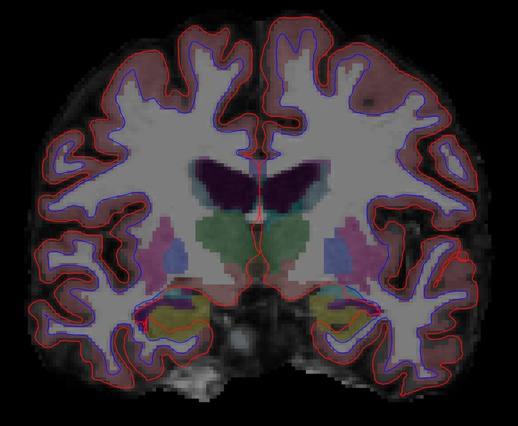

<!-- markdownlint-disable MD033-->
# `t1-freesurfer` – FreeSurfer-based processing of T1-weighted MR images

This pipeline performs cortical surface extraction, segmentation of subcortical structures [[Dale et al., 1999](http://dx.doi.org/10.1006/nimg.1998.0395)], cortical thickness estimation [[Fischl and Dale, 2000](http://dx.doi.org/10.1073/pnas.200033797)], spatial normalization onto the FreeSurfer surface template (FsAverage) [[Fischl et al., 1999a](http://dx.doi.org/10.1006/nimg.1998.0396)], and parcellation of cortical regions based on different atlases [[Fischl et al., 2004](http://dx.doi.org/10.1093/cercor/bhg087)], using the [FreeSurfer `recon-all`](https://surfer.nmr.mgh.harvard.edu/fswiki/recon-all) command.
Additionally, from the FreeSurfer outputs, we generate TSV files containing a summary of the regional statistics (e.g. regional volume, mean cortical thickness) to ease subsequent statistical analysis.

## Dependencies

If you only installed the core of Clinica, this pipeline needs the installation of [FreeSurfer 6.0](../Software/Third-party.md#freesurfer) on your computer.

## Running the pipeline

The pipeline can be run with the following command line:

```Text
clinica run t1-freesurfer [OPTIONS] BIDS_DIRECTORY CAPS_DIRECTORY
```

where:

- `BIDS_DIRECTORY` is the input folder containing the dataset in a [BIDS](../BIDS.md) hierarchy.
- `CAPS_DIRECTORY` is the output folder containing the results in a [CAPS](../CAPS/Introduction.md) hierarchy.

with specific options : 

- `-raa/--recon_all_args` : For people familiar with FreeSurfer, we compute the normalized data on the FreeSurfer atlas (FsAverage) with the `-qcache` option from `recon-all`.
    If you want to add some custom flags, you can do it in Clinica with this option. For example : `--recon_all_args="-bigventricles -qcache"`.
    **Please note that `=` is compulsory.**
--8<-- "snippets/pipelines_options.md:freesurfer"

??? info "Optional parameters common to all pipelines"
    --8<-- "snippets/pipelines_options.md:all"

!!! note "Computational time"
    The computational time for one subject is around **10–15 hours** depending on your CPU and the quality of your input T1.
    Please be aware that even though the pipeline runs in parallel, processing many subjects (e.g. ADNI dataset) is time consuming.

--8<-- "snippets/known_issues.md:center-nifti"
    

## Outputs

Results are stored in the following folder of the [CAPS hierarchy](../CAPS/Specifications.md/#t1-freesurfer---freesurfer-based-processing-of-t1-weighted-mr-images): `subjects/<participant_id>/<session_id>/t1/freesurfer_cross_sectional`.

This folder contains the standard output structure of the `recon-all` command, i.e. folders such as `label/`, `mri/`, `surf/`, etc.

Among the files generated by FreeSurfer, you may be interested in the following outputs:

- `*/mri/aseg.mgz`: subcortical segmentation volume
- `*/mri/wm.mgz`: white matter mask
- `*/mri/brainmask.mgz`: skull-stripped volume
- `*/surf/{l|r}h.white`: white surface between white matter and gray matter
- `*/surf/{l|r}h.pial`: pial surface between gray matter and CSF (where `*` stands for `<participant_id>_<session_id>`)

More details regarding the `recon-all` output files can be found on the [FreeSurfer website](https://surfer.nmr.mgh.harvard.edu/fswiki/ReconAllOutputFiles).

<center></center>

*<center>Visualization of `t1-freesurfer` outputs.</center>*

TSV files summarizing the regional statistics are also created for each subject.

!!! note
    The full list of features extracted from the FreeSurfer pipeline can be found in [The ClinicA Processed Structure (CAPS) specifications](../../CAPS/Specifications/#t1-freesurfer-freesurfer-based-processing-of-t1-weighted-mr-images).

<!-- ## Visualization of the results

!!! note
    The visualization command is not available for the moment. Please come back later, this section will be updated ASAP. -->

## Describing this pipeline in your paper

!!! cite "Example of paragraph (short version):"
    These results have been obtained using the `t1-freesurfer` pipeline of Clinica [[Routier et al., 2021](https://doi.org/10.3389/fninf.2021.689675)].
    This pipeline is a wrapper of different tools of the FreeSurfer software (<http://surfer.nmr.mgh.harvard.edu/>) [[Fischl et al., 2012](http://dx.doi.org/10.1016/j.neuroimage.2012.01.021)].
    This processing includes segmentation of subcortical structures, extraction of cortical surfaces, cortical thickness estimation, spatial normalization onto the FreeSurfer surface template (FsAverage), and parcellation of cortical regions.

??? cite "Example of paragraph (long version):"
    These results have been obtained using the `t1-freesurfer` pipeline of Clinica
    [[Routier et al., 2021](https://doi.org/10.3389/fninf.2021.689675)].
    This pipeline is a wrapper of different tools of the FreeSurfer software, which is documented and freely available for download online (<http://surfer.nmr.mgh.harvard.edu/>).
    The technical details of these procedures are described in prior publications
    [[Dale et al., 1999](http://dx.doi.org/10.1006/nimg.1998.0395);
    [Dale and Sereno, 1993](http://dx.doi.org/10.1162/jocn.1993.5.2.162);
    [Fischl and Dale, 2000](http://dx.doi.org/10.1073/pnas.200033797);
    [Fischl et al., 2001](http://dx.doi.org/10.1109/42.906426);
    [Fischl et al., 2002](http://dx.doi.org/10.1016/S0896-6273(02)00569-X);
    [Fischl et al., 2004a](http://dx.doi.org/10.1016/j.neuroimage.2004.07.016);
    [Fischl et al., 1999a](http://dx.doi.org/10.1006/nimg.1998.0396);
    [Fischl et al., 1999b](http://dx.doi.org/10.1002/(SICI)1097-0193(1999)8:4<272::AID-HBM10>3.0.CO;2-4);
    [Fischl et al., 2004b](http://dx.doi.org/10.1093/cercor/bhg087);
    [Han et al., 2006](http://dx.doi.org/10.1016/j.neuroimage.2006.02.051);
    [Jovicich et al., 2006](http://dx.doi.org/10.1016/j.neuroimage.2005.09.046);
    [Segonne et al., 2004](http://dx.doi.org/10.1016/j.neuroimage.2004.03.032);
    [Reuter and Fischl, 2010](http://dx.doi.org/10.1016/j.neuroimage.2011.02.076);
    [Reuter et al., 2012](http://dx.doi.org/10.1016/j.neuroimage.2012.02.084)].
    Briefly, this processing includes removal of non-brain tissue using a hybrid watershed/surface deformation procedure [[Segonne et al., 2004](http://dx.doi.org/10.1016/j.neuroimage.2004.03.032)], automated Talairach transformation, segmentation of the subcortical white matter and
    deep gray matter volumetric structures (including hippocampus, amygdala, caudate, putamen, thalamus, ventricles) [[Fischl et al., 2002](http://dx.doi.org/10.1016/S0896-6273(02)00569-X);
    [Fischl et al., 2004a](http://dx.doi.org/10.1016/j.neuroimage.2004.07.016)], intensity normalization [[Sled et al., 1998](http://dx.doi.org/10.1109/42.668698)], tessellation of the gray matter/white matter boundary, automated topology correction [[Fischl et al., 2001](http://dx.doi.org/10.1109/42.906426);
    [Segonne et al., 2007](http://dx.doi.org/10.1109/TMI.2006.887364)], and
    surface deformation following intensity gradients to optimally place the gray/white and
    gray/cerebrospinal fluid borders at the location where the greatest shift in intensity defines the transition to the other tissue class
    [[Dale et al., 1999](http://dx.doi.org/10.1006/nimg.1998.0395);
    [Dale and Sereno, 1993](http://dx.doi.org/10.1162/jocn.1993.5.2.162);
    [Fischl and Dale, 2000](http://dx.doi.org/10.1073/pnas.200033797)], surface inflation [[Fischl et al., 1999a](http://dx.doi.org/10.1006/nimg.1998.0396)], registration to a spherical atlas which is based on individual cortical folding patterns to match cortical geometry across subjects [[Fischl et al., 1999b](http://dx.doi.org/10.1002/(SICI)1097-0193(1999)8:4<272::AID-HBM10>3.0.CO;2-4)], parcellation of the cerebral cortex into units with respect to gyral and sulcal structures [[Desikan et al., 2006](http://dx.doi.org/10.1016/j.neuroimage.2006.01.021);
    [Fischl et al., 2004b](http://dx.doi.org/10.1093/cercor/bhg087)], computation of maps of cortical thickness, calculated as the closest distance from the gray/white boundary to the gray/CSF boundary at each vertex on the tessellated surface [[Fischl and Dale, 2000](http://dx.doi.org/10.1073/pnas.200033797)] and creation of a variety of surface based data including maps of curvature and sulcal depth.
    Procedures for the measurement of cortical thickness have been validated against histological analysis [[Rosas et al., 2002](http://dx.doi.org/10.1212/WNL.58.5.695)] and manual measurements [[Kuperberg et al., 2003](http://dx.doi.org/10.1001/archpsyc.60.9.878);
    [Salat et al., 2004](http://dx.doi.org/10.1093/cercor/bhh032)].
    FreeSurfer morphometric procedures have been demonstrated to show good test-retest reliability across scanner manufacturers and across field strengths
    [[Han et al., 2006](http://dx.doi.org/10.1016/j.neuroimage.2006.02.051);
    [Reuter et al., 2012](http://dx.doi.org/10.1016/j.neuroimage.2012.02.084)].

!!! tip
    Easily access the papers cited on this page on [Zotero](https://www.zotero.org/groups/2240070/clinica_aramislab/items/collectionKey/GHAXT4R5).

## Support

- You can use the [Clinica Google Group](https://groups.google.com/forum/#!forum/clinica-user) to ask for help!
- Report an issue on [GitHub](https://github.com/aramis-lab/clinica/issues).

## Appendix: Main steps of the `t1-freesurfer` pipeline

Following the links to visualize diagrams summarizing the main steps of the `t1-freesurfer` pipeline: [pre-processing](../img/T1_FreeSurfer/t1-freesurfer_pipeline1.svg), [voxel-based processing](../img/T1_FreeSurfer/t1-freesurfer_pipeline2.svg), [surface-based processing](../img/T1_FreeSurfer/t1-freesurfer_pipeline3.svg).
For a detailed explanation of the FreeSurfer `recon-all` pipeline, click [here](https://surfer.nmr.mgh.harvard.edu/fswiki/recon-all).
