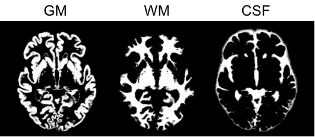
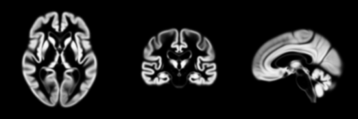
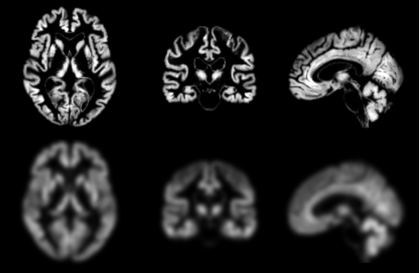

<!-- markdownlint-disable MD007 MD033 -->
# `t1-volume` – Volume-based processing of T1-weighted MR images with SPM

This pipeline performs four main processing steps on T1-weighted MR images using the [SPM](http://www.fil.ion.ucl.ac.uk/spm/) software:

- **Tissue segmentation, bias correction and spatial normalization to MNI space**
This corresponds to the `Segmentation` procedure of SPM that simultaneously performs tissue segmentation, bias correction and spatial normalization, a procedure also known as "Unified segmentation" [[Ashburner and Friston, 2005](http://dx.doi.org/10.1016/j.neuroimage.2005.02.018)].

- **Inter-subject registration using Dartel**
A group template is created using DARTEL, an algorithm for diffeomorphic image registration, from the subjects' tissue probability maps in native space (usually GM, WM and CSF tissues) obtained at the previous step.
Here, not only the group template is obtained, but also the deformation fields from each subject's native space into the Dartel template space.
This is achieved by wrapping the `Run Dartel` procedure from SPM [[Ashburner, 2007](http://dx.doi.org/10.1016/j.neuroimage.2007.07.007)].

- **Dartel template to MNI**
Once the transformation from the subject’s T1-weighted MRI image to the Dartel template has been computed, the T1-weighted MRI image of each subject can be transported to the MNI space.
More precisely, for a given subject, its flow field into the Dartel template is combined with the transformation of the Dartel template into MNI space, and the resulting transformation is applied to the subject’s different tissue maps.
As a result, all the images are in a common space, providing a voxel-wise correspondence across subjects.
This is achieved by wrapping the `Dartel2MNI` procedure from SPM [[Ashburner, 2007](http://dx.doi.org/10.1016/j.neuroimage.2007.07.007)].

- **Atlas statistics**
A set of anatomical regions is obtained from different atlases in MNI space (list of available atlases [here](../../Atlases)).
The average gray matter density (also in MNI space) is then computed in each of the regions.

## Dependencies

If you only installed the core of Clinica, this pipeline needs the installation of either [SPM12](../Software/Third-party.md#spm12) and [Matlab](../Software/Third-party.md#matlab), or [SPM standalone](../Software/Third-party.md#spm12-standalone) on your computer.

## Running the pipeline

The pipeline `t1-volume` can be run with the following command line:

```Text
clinica run t1-volume [OPTIONS] BIDS_DIRECTORY CAPS_DIRECTORY GROUP_LABEL
```

where:

- `BIDS_DIRECTORY` is the input folder containing the dataset in a [BIDS](../BIDS.md) hierarchy.
- `CAPS_DIRECTORY` is the output folder containing the results in a [CAPS](../CAPS/Introduction.md) hierarchy.
- `GROUP_LABEL` is the user-defined identifier for the provided group of subjects.

Pipeline options:

- `--smooth`: a list of integers specifying the different isomorphic [full width at half maximum (FWHM)](../glossary.md#fwhm) in millimeters used to smooth the images. Default value is: `8`.
- `--tissue_classes`: a list of integers (possible values range from 1 to 6) that indicates the tissue classes to save after segmentation (in order: gray matter (GM), white matter (WM), cerebrospinal fluid (CSF), bone, soft-tissue, air/background). Default value is: `1, 2, 3` (GM, WM and CSF are saved).
- `--dartel_tissues`: a list of integers (possible values range from 1 to 6) that indicates the tissue classes to use for the Dartel template calculation (in order: GM, WM, CSF, bone, soft-tissue, air/background). Default value is: `1, 2, 3` (GM, WM and CSF are used).
- `--modulate / --no-modulate`: a flag. If enabled, output images are modulated and volumes are preserved. If disabled, they are not modulated and concentrations are preserved. Default value: `--modulate`.
- `--caps-name` : Specify the name of the CAPS dataset that will be created to store the outputs of the pipeline. This works if this CAPS dataset does not exist yet, otherwise the existing name will be kept. The provided name will appear in the `dataset_description.json` file, at the root of the CAPS folder (see [CAPS Specifications](../CAPS/Specifications.md#the-dataset_descriptionjson-file) for more details).

!!! warning "Centering BIDS nifti"
    If the images from the `BIDS_DIRECTORY` are not centered, Clinica will give a warning because this can be an issue **if** later processing steps involve SPM (for instance if you are planning to run [pet-volume](./PET_Volume.md) afterwards).
    The warning message will contain a suggestion of a command to be run on your `BIDS_DIRECTORY` in order to generate a new BIDS dataset with images centered. This relies on the IOTool [center-nifti](../IOTools/center_nifti.md).
    It is highly recommended to follow this recommendation but Clinica won't force you to do so.

!!! note
    - The arguments common to all Clinica pipelines are described in [Interacting with clinica](../../InteractingWithClinica).
    - The creation of a new Dartel template, performed in the `t1-volume` pipeline, requires at least two images.

!!! tip
    Do not hesitate to type `t1-volume --help` to see the full list of parameters.

## Outputs

### Tissue segmentation, bias correction and spatial normalization

Results are stored in the following folder of the [CAPS hierarchy](../CAPS/Specifications.md#segmentation): `subjects/<participant_id>/<session_id>/t1/spm/segmentation`.

The main output files are:

- native_space/:
    - `<source_file>_segm-{graymatter|whitematter|csf}_probability.nii.gz`: The tissue probability maps for the gray matter, white matter and CSF.
- normalized_space/
    - `<source_file>_space-Ixi549Space_T1w.nii.gz`: The T1-weighted image in MNI space.
    - `<source_file>_segm-{graymatter|whitematter|csf}_space-Ixi549Space_modulated-off_probability.nii.gz`: The different tissue maps that have been registered to the MNI space without modulation, i.e. no division by the jacobian of the transformation meaning that concentrations are preserved.
    These outputs are useful if you want to QC both the registration into MNI and the accuracy of the segmentations.

<center></center>
*<center><small>Example of gray matter (GM), white matter (WM) and CSF tissue segmentation.</small></center>*

### Inter-subject registration using Dartel

The final estimation of the gray matter template is stored under the following folder of the [CAPS hierarchy](../CAPS/Specifications.md#dartel): `groups/group-<group_label>/t1/group-<group_label>_template.nii.gz`

<center></center>
*<center><small>Example of a group template calculated using DARTEL. Only the gray matter class is shown.</small></center>*

The flow fields containing the deformation from an image to the group template are stored in the folder
`subjects/<participant_id>/<session_id>/t1/spm/dartel/group-<group_label>/`
under the filename
`<source_file>_target-<group_label>_transformation-forward_deformation.nii.gz`.

### Dartel template to MNI

Results are stored in the following folder of the [CAPS hierarchy](../CAPS/Specifications.md#dartel-to-mni): `subjects/<participant_id>/<session_id>/t1/spm/dartel/group-<group_label>`.

The main output files are:

- `<source_file>_segm-{graymatter|whitematter|csf}_space-Ixi549Space_modulated-on_fwhm-<label>_probability.nii.gz`: The modulated tissue probability maps, i.e. the tissue probability maps obtained with multiplied by their relative volume before and after spatial normalisation, into the MNI space.
The different tissue maps that have been registered to the MNI space and modulated, i.e. divided by the jacobian of the transformation meaning that volume is preserved.

 <center></center>
 *<center><small>Final result: Probability Gray Matter in MNI space without smoothing (top) or smoothed using a 8 mm FWHM kernel (bottom).</small></center>*

### Atlas statistics

Results are stored in the following folder of the [CAPS hierarchy](../CAPS/Specifications.md#atlas-statistics): `subjects/<participant_id>/<session_id>/t1/spm/dartel/group-<group_label>/atlas_statistics/`.

The main output file is:

- `<source_file>_space-<space>_map-graymatter_statistics.tsv`: TSV files summarizing the regional statistics on the labelled atlas `<space>`.

!!! note
    The full list of output files can be found in the [The ClinicA Processed Structure (CAPS) specifications](../CAPS/Specifications.md#t1-volume-pipeline---volume-based-processing-of-t1-weighted-mr-images).

## Going further

- If you have PET data, you can now run the [`pet-volume` pipeline](../PET_Volume) to obtain standardized uptake value ratio maps.
- You can use mean gray matter maps to perform group comparison with the [`statistics-volume` pipeline](../Stats_Volume).
- You can perform classification based on [machine learning](../MachineLearning_Classification), as showcased in the [AD-ML framework](https://github.com/aramis-lab/AD-ML).

## Describing this pipeline in your paper

!!! cite "Example of paragraph for the `t1-volume` pipeline:"
    These results have been obtained using the `t1-volume` pipeline of Clinica
    [[Routier et al., 2021](https://doi.org/10.3389/fninf.2021.689675);
    [Samper et al., 2018](https://doi.org/10.1016/j.neuroimage.2018.08.042)].
    This pipeline is a wrapper of the `Segmentation`, `Run Dartel` and `Normalise to MNI Space` routines implemented in [SPM](http://www.fil.ion.ucl.ac.uk/spm/).
    First, the Unified Segmentation procedure [[Ashburner and Friston, 2005](http://dx.doi.org/10.1016/j.neuroimage.2005.02.018)] is used to simultaneously perform tissue segmentation, bias correction and spatial normalization of the input image
    Next, a group template is created using DARTEL, an algorithm for diffeomorphic image registration [[Ashburner, 2007](http://dx.doi.org/10.1016/j.neuroimage.2007.07.007)], from the subjects’ tissue probability maps on the native space, usually GM, WM and CSF tissues, obtained at the previous step.
    The DARTEL to MNI method [[Ashburner, 2007](http://dx.doi.org/10.1016/j.neuroimage.2007.07.007)] is then applied, providing a registration of the native space images into the MNI space.
    Finally, a set of anatomical regions are obtained from different atlases in MNI space
    [Tzourio-Mazoyer et al., [2002](http://dx.doi.org/10.1006/nimg.2001.0978),
    [2015](http://dx.doi.org/10.1016/j.neuroimage.2015.07.075);
    [Joliot et al., 2015](http://dx.doi.org/10.1016/j.jneumeth.2015.07.013);
    [Hammers et al., 2003](http://dx.doi.org/10.1002/hbm.10123);
    [Gousias et al., 2008](http://dx.doi.org/10.1016/j.neuroimage.2007.11.034);
    [Shattuck et al., 2008](http://dx.doi.org/10.1016/j.neuroimage.2007.09.031);
    [CAT12](http://dbm.neuro.uni-jena.de/cat/)],
    and the average gray matter density is computed in each of the regions.

!!! tip
    Easily access the papers cited on this page on [Zotero](https://www.zotero.org/groups/2240070/clinica_aramislab/items/collectionKey/TSSYS523).

## Support

- You can use the [Clinica Google Group](https://groups.google.com/forum/#!forum/clinica-user) to ask for help!
- Report an issue on [GitHub](https://github.com/aramis-lab/clinica/issues).

## Advanced usage

The four main processing steps of the `t1-volume` pipeline can be performed individually:

- **A: Tissue segmentation, bias correction and spatial normalization to MNI space**

    Command line:

    ```Text
    clinica run t1-volume-tissue-segmentation <bids_directory> <caps_directory>
    ```

- **B1: Inter-subject registration using Dartel (creating a new Dartel template)**

    Command line:

    ```Text
    clinica run t1-volume-create-dartel <bids_directory> <caps_directory> <group_label>
    ```

- **B2: Inter-subject registration using Dartel (using an existing Dartel template)**

    Command line:

    ```Text
    clinica run t1-volume-register-dartel <bids_directory> <caps_directory> <group_label>
    ```

- **C: Dartel template to MNI**

    Command line:

    ```Text
    clinica run t1-volume-dartel2mni <bids_directory> <caps_directory> <group_label>
    ```

- **D: Atlas statistics**

    Command line:

    ```Text
    clinica run t1-volume-parcellation <caps_directory> <group_label>
    ```

These four processing steps can also be performed in one go with one of these two functions:

- `t1-volume` = A + B1 + C + D (to create a new Dartel template)
- `t1-volume-existing-template` = A + B2 + C + D (to reuse an existing Dartel template)
